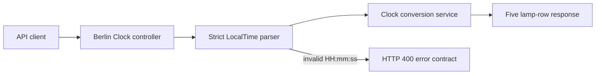

# Berlin Clock API
2026-CCE-E-DEV-031-BerlinClock

## Description 
This project is a simple REST API that converts digital time (HH:mm:ss) into the Berlin Clock representation.
The description of the kata can be found [here](https://stephane-genicot.github.io/BerlinClock.html).

This project is implemented as part of a technical coding exercise and demonstrates:
- Clean architecture
- Test-driven development (TDD)
- REST API best practices
- Containerization and CI integration

## Tech Stack
- Java 21
- Spring Boot 4.1.1
- Gradle 9.7.1
- JUnit 5 
- Springdoc OpenAPI UI (Swagger)
- Docker
- Github Actions (CI)

## Requirements
- JDK 21 (any OpenJDK distribution)
- The included Gradle Wrapper

## Build
Clone the repository and run:

```bash
./gradlew clean build
```

## Run
```bash
./gradlew bootRun
```

## Build image
```bash
docker build -t berlin-clock .
```

## API Documentation (Swagger)
http://localhost:8080/swagger-ui/index.html

## Example Request
```bash
curl "http://localhost:8080/api/berlin-clock?time=13:17:01"
```

## Example Response
```
{
  "seconds": "0",
  "fiveHours": "RR00",
  "oneHour": "RRR0",
  "fiveMinutes": "YYR00000000",
  "oneMinute": "YY00"
}
```

## Architecture



The service is stateless. GitHub Actions verifies the Java 21 test suite and
builds the non-root container image on modernization pushes and pull requests.
